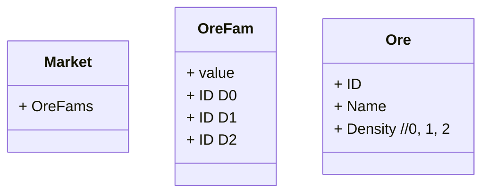
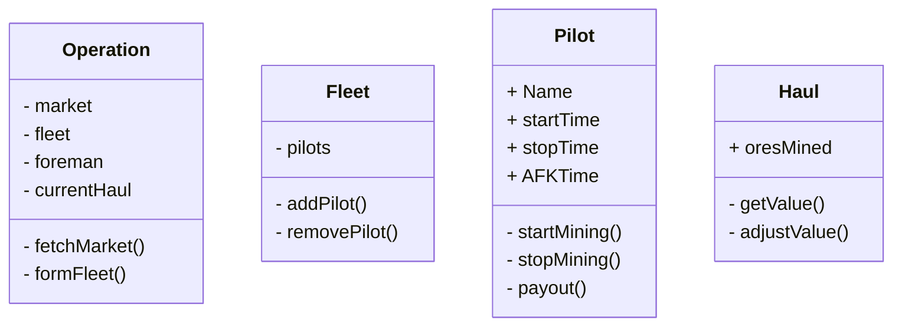

# EveForeman README.md

Open Source Mining Sheet For Eve Online

> Goal: Develop an open source tracking sheet for fleet ops.

>  [Example](https://docs.google.com/spreadsheets/d/1saIzsQe26twQZy-U0qnRo6SS7B9M1QJx0Xe3r3mN5sY/edit?usp=sharing)

## Setup

1. You need to have [Node](https://nodejs.org/) installed on whatever device is serving this web-app
2. After Pulling this repo run `npm install` in the root directory to pull dependencies:

```
npm install
```

3. Running Test Server.js

```BASH
node server.js // http://localhost:3000/
```
3b.  For live reload while devleoping, use `nodemon` instead

```BASH
./node_modules/.bin/nodemon server.js
```


----

# EveForeman: Working Document

## Immediate Goals:

1. Track time started / stopped / AFK per player
	1. Weight payout by active participation
2. Track Ships flown 
	1. Weight payout by potential earned
3. Track Ore Pulled
4. Determine value of haul and compute payouts
5. Allow foreman (user) ability to override any values as needed or desired


## Decisions:

### Database:

* [Mongo](https://www.w3schools.com/nodejs/nodejs_mongodb.asp)
* [Setup Local Mongo DB](https://zellwk.com/blog/local-mongodb/)

### Templating / UI

* Pending...
* https://www.codeinwp.com/blog/angular-vs-vue-vs-react/


### Style: [SCSS](https://sass-lang.com/)


## Long Term Goal: Solution for Price Auto Population

1. Pull from https://evepraisal.com/
	1. https://npm.taobao.org/package/evepraisal
2. Pull from https://eve-marketdata.com/


## Long Term Goal: Solution for Quality of Life

Tools for character / corp 


## Outlining Architecture

* [Pretty Diagrams](https://support.typora.io/Draw-Diagrams-With-Markdown/)




----


