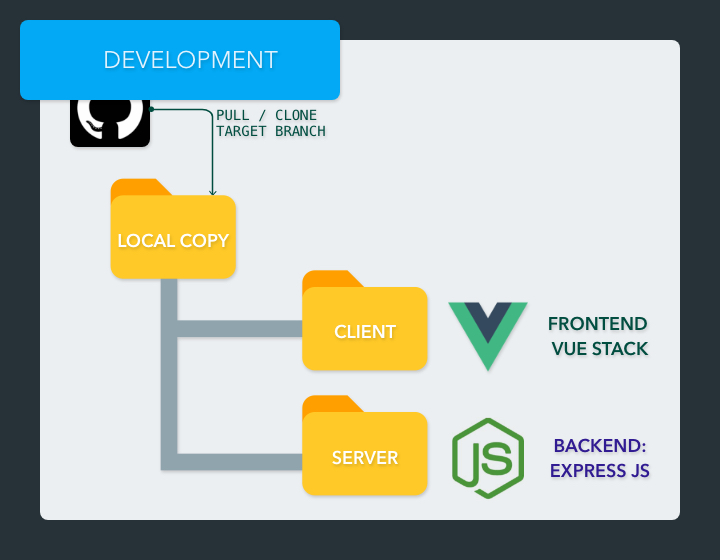
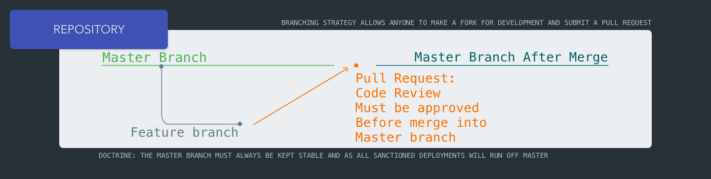
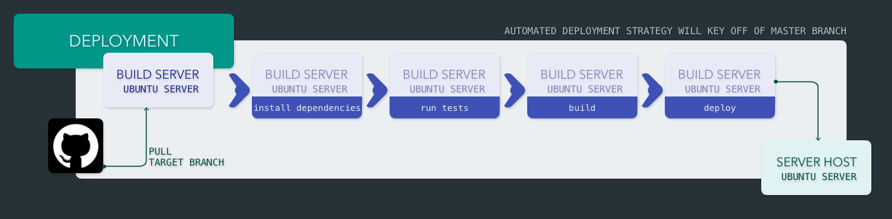
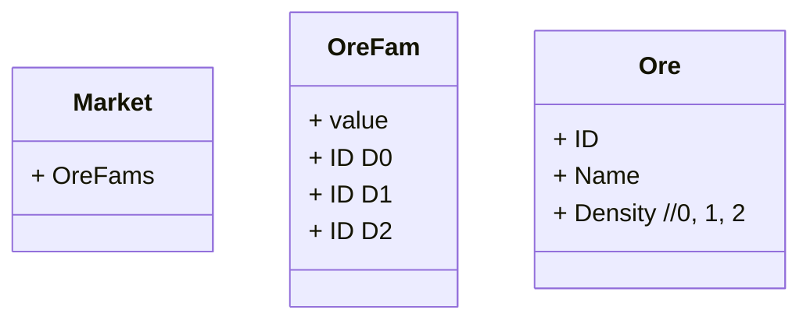
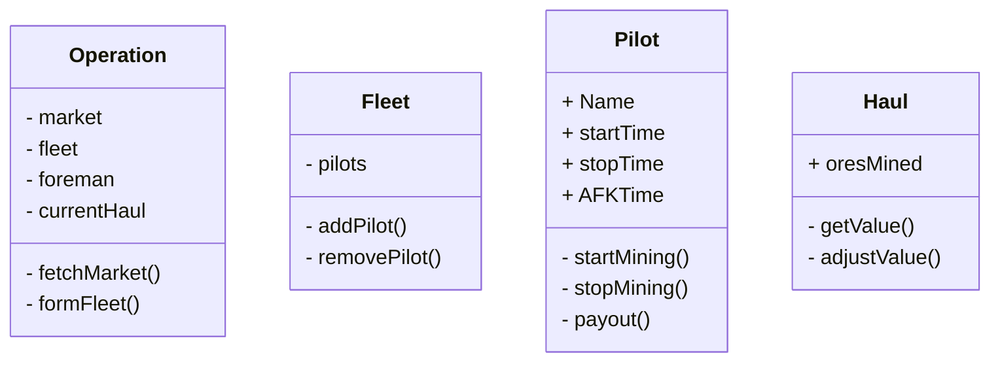

###### EveForeman README.md

Overview
========

Open Source Mining Sheet For Eve Online

> Goal: Develop an open source tracking sheet for fleet ops.

>  [Example](https://docs.google.com/spreadsheets/d/1saIzsQe26twQZy-U0qnRo6SS7B9M1QJx0Xe3r3mN5sY/edit?usp=sharing)

Getting Started
===============

## Pramble

1. Build scripts have not yet been configured for Windows developers.
	1. *If you are already proficient in node development on a Windows and can add support please open a PR* 
2. You need to have [Node](https://nodejs.org/) installed on whatever device is serving this web-app
3. Recommend tools: [VSCode](https://code.visualstudio.com/)

Overview
---

The project is separated out into two distinct components:

*   Client
*   Server 

Each need to be setup before running against your host machine

Client Setup
---

1.  using your command line step into the `./client` folder
2.  run `npm install`
3.  ` npm run dev`

>    By default the client can be accessed http://localhost:8080

Server Setup
---

1.  using your command line, step into the `./sterver` folder
2.  run `npm install`
3.  run `npm start`

>    By default the server can be checked by hitting http://localhost:8081/status

SQL Notes
---------

> pending...

* https://sequelize.org/

Development Strategy
====================

> Details Pending...

Branching Strategy
==================

> Details Pending...

Deployment Strategy
===================

> Details Pending...

1. 

----

# EveForeman: Working Document

## Immediate Goals:

1. Track time started / stopped / AFK per player
	1. Weight payout by active participation
2. Track Ships flown 
	1. Weight payout by potential earned
3. Track Ore Pulled
4. Determine value of haul and compute payouts
5. Allow foreman (user) ability to override any values as needed or desired

### Style: [SCSS](https://sass-lang.com/)

## Long Term Goal: Solution for Price Auto Population

1. Pull from https://evepraisal.com/
	1. https://npm.taobao.org/package/evepraisal
2. Pull from https://eve-marketdata.com/

## Long Term Goal: Solution for Quality of Life

Tools for character / corp 

## Outlining Architecture

* [Pretty Diagrams](https://support.typora.io/Draw-Diagrams-With-Markdown/)

----

